class: inverse, middle, center

# Neural networks are awesome ...


---

# Deep learning yields excellent results in e.g. 

<br />

- Image recognition (classification, segmentation, object detection)

- Natural language processing (language models, translation, generation)

- Domain modeling (embeddings)

- Entity generation ("fakes"): Faces, animals, scenes...

- Tasks involving tabular data (e.g., recommender systems)

- Playing games (deep reinforcement learning)

---

class: inverse, middle, center

# So what are we missing?

---

# Networks output _point estimates_

<br />


- A single numeric prediction 

- A single segmentation mask

- A single translation

- A single embedding

<br />
 
But wait ... aren't there probabilities in there, _somewhere_?

---
# Let's see an example!

```{r}
library(magick)
# Attribution: Ben Tubby [CC BY 2.0 (https://creativecommons.org/licenses/by/2.0)]
# https://upload.wikimedia.org/wikipedia/commons/3/30/Falkland_Islands_Penguins_35.jpg
path <- "penguin1.jpg" 
image_read(path) %>% image_resize("160")
```

---
# Let's ask the network ...

```{r, eval=FALSE}
library(tensorflow)
library(keras)

model <- application_mobilenet_v2()
image <- # do some preprocessing ...
probs <- model %>% predict(image)
imagenet_decode_predictions(probs)
```

```
  class_name class_description        score
1  n02056570      king_penguin 0.9899597168
2  n01847000             drake 0.0011793933
3  n01798484   prairie_chicken 0.0002387235
4  n02058221         albatross 0.0002117234
5  n02071294      killer_whale 0.0001432021
```

---
# Let's do another one

```{r}
# Attribution: M. Murphy [Public domain]
# https://upload.wikimedia.org/wikipedia/commons/2/22/RoyalPenguins3.JPG
path <- "penguin2.jpg" 
image_read(path) %>% image_resize("180")
```

---
# So?

```{r, eval=FALSE}
probs <- model %>% predict(image)
imagenet_decode_predictions(probs)
```

<br />

```
  class_name class_description      score
1  n02051845           pelican 0.24614049
2  n02009912    American_egret 0.18564136
3  n02058221         albatross 0.06848499
4  n02012849             crane 0.04572001
5  n02009229 little_blue_heron 0.03902744
```

---
# Stepping back: What's a neural network?


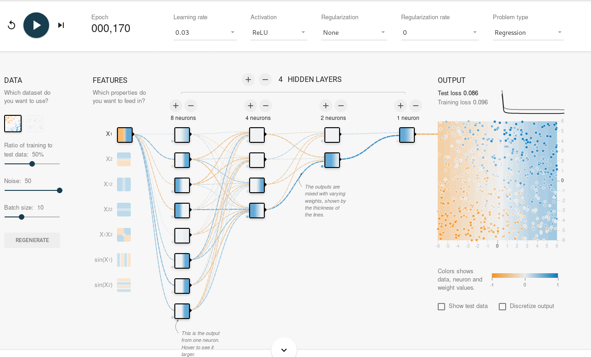

---
# Zooming in: Weights and activations

<figure>
    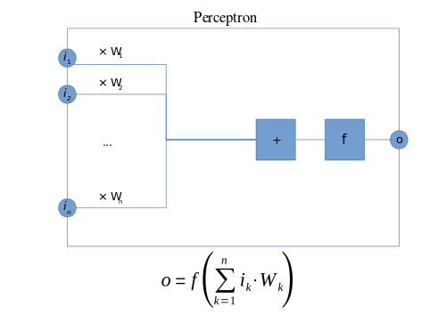
    <figcaption>Source: https://en.wikipedia.org/wiki/Perceptron</figcaption>
</figure>


---

# Regression with Keras

```{r, eval=FALSE}
model <- keras_model_sequential() %>%
  layer_dense(units = 32, activation = "relu", input_shape = 7) %>%
  # default activation = linear
  layer_dense(units = 1)

```

<figure>
    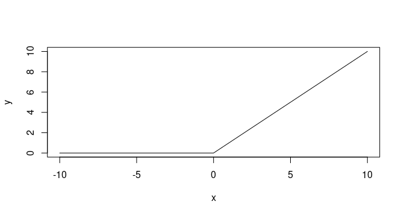
    <figcaption><b>ReLU</b> activation</figcaption>
</figure>


---

# (Binary) Classification with Keras

```{r, eval=FALSE}
model <- keras_model_sequential() %>%
  layer_dense(units = 32, activation = "relu", input_shape = 7) %>%
  layer_dense(units = 1, activation = "sigmoid")
```

<figure>
    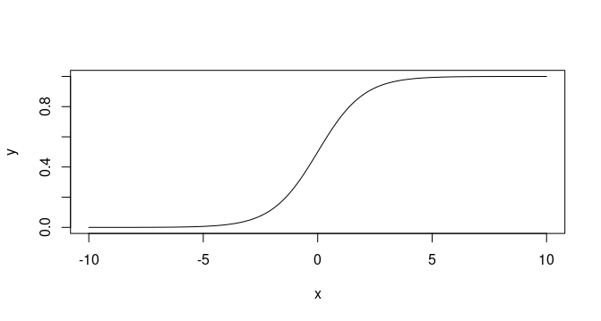
    <figcaption><b>Sigmoid</b> activation</figcaption>
</figure>

---

# (Multiple) Classification with Keras

```{r, eval=FALSE}
model <- keras_model_sequential() %>%
  layer_dense(units = 32, activation = "relu", input_shape = 7) %>%
  layer_dense(units = 10, activation = "softmax")
```

<figure>
    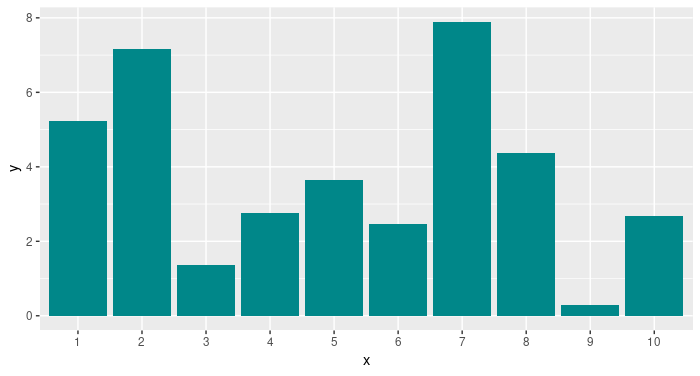
</figure>
<figure>
    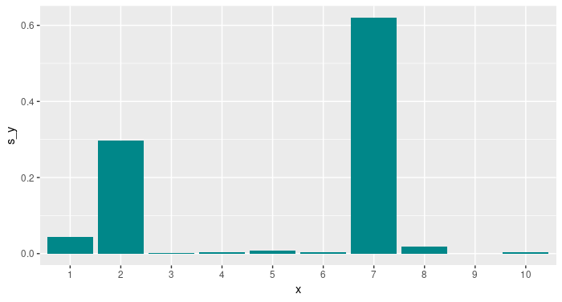
</figure>

Before and after __softmax__ activation.

---

# So our "probability" is just a maximum likelihood estimate ...

<br />

... how can we make this probabilistic?

---
class: inverse, middle, center

# Bayesian networks 

---

# Put distributions over the network's weights


<figure>
    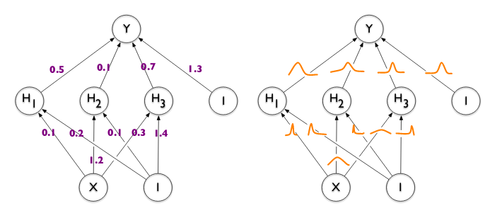
    <figcaption>Blundell et al. (2015): Weight Uncertainty in Neural Networks</figcaption>
</figure>


---
# Yeah, but how?

<br />

[TensorFlow Probability](https://www.tensorflow.org/probability/) (Python library on top of TensorFlow)

[tfprobability](https://rstudio.github.io/tfprobability/) (R package)

<br />

```{r, eval=FALSE}
devtools::install_github("rstudio/tfprobability")

library(tensorflow)
install_tensorflow()
```


---
# tfprobability (1): Basic building blocks

#### Distributions

```{r, eval=FALSE}
d <- tfd_binomial(total_count = 7, probs = 0.3)
d %>% tfd_mean()
#> tf.Tensor(2.1000001, shape=(), dtype=float32)
d %>% tfd_variance()
#> tf.Tensor(1.47, shape=(), dtype=float32)
d %>% tfd_log_prob(2.3)
#> tf.Tensor(-1.1914139, shape=(), dtype=float32)
```

#### Bijectors

```{r, eval=FALSE}
b <- tfb_affine_scalar(shift = 3.33, scale = 0.5)
x <- c(100, 1000, 10000)
b %>% tfb_forward(x)
#> tf.Tensor([  53.33  503.33 5003.33], shape=(3,), dtype=float32)
```


---
# tfprobability (2): Higher-level modules

<br />

- Keras layers 

- Markov Chain Monte Carlo (Hamiltonian Monte Carlo, NUTS)

- Variational inference

- State space models

- GLMs

---
class: inverse, middle, center

# How does that help us?


---
# With TFP, neural network layers can be _distributions_

<br />
A network that has a multivariate normal distribution as output

```{r, eval=FALSE}
model <- keras_model_sequential() %>%
  layer_dense(units = params_size_multivariate_normal_tri_l(d)) %>%
  layer_multivariate_normal_tri_l(event_size = d)

log_loss <- function (y, model) - (model %>% tfd_log_prob(y))

model %>% compile(optimizer = "adam", loss = log_loss)

model %>% fit(
  x,
  y,
  batch_size = 100,
  epochs = 1,
  steps_per_epoch = 10
)
```

---
# More distribution layers

<figure>
    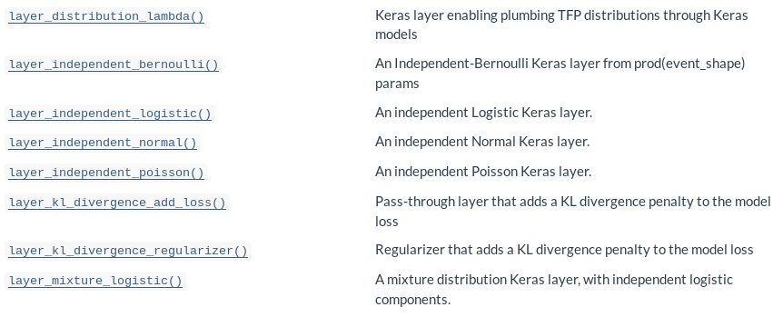
    <figcaption>Complete list: <a href="https://rstudio.github.io/tfprobability/reference/index.html#section-keras-layers-distribution-layers">Distribution layers</a></figcaption>
</figure>

---
# Outputting a distribution: Aleatoric uncertainty


Instead of a single unit (of a _dense_ layer), we output a __normal distribution__:

```{r, eval=FALSE}
model <- keras_model_sequential() %>%
  layer_dense(units = 8, activation = "relu") %>%
  layer_dense(units = 2, activation = "linear") %>%
  layer_distribution_lambda(function(x)
    tfd_normal(loc = x[, 1, drop = FALSE],
               scale = 1e-3 + tf$math$softplus(x[, 2, drop = FALSE])
               )
  )

negloglik <- function(y, model) - (model %>% tfd_log_prob(y))
model %>% compile(
  optimizer = optimizer_adam(lr = 0.01),
  loss = negloglik
)
model %>% fit(x, y, epochs = 1000)

```

---
# Aleatoric uncertainty ~ learned spread in the data

```{r, eval=FALSE}
yhat <- model(tf$constant(x_test))
mean <- yhat %>% tfd_mean()
sd <- yhat %>% tfd_stddev()
```

<figure>
    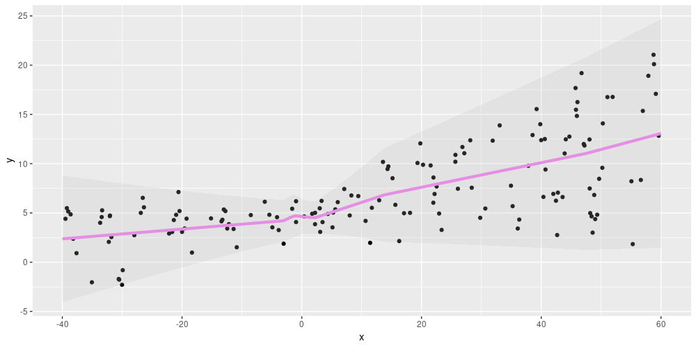
</figure>

---
# Placing a distribution over the weights: Epistemic uncertainty

```{r, eval=FALSE}
model <- keras_model_sequential() %>%
  layer_dense_variational(
    units = 1,
    make_posterior_fn = posterior_mean_field,
    make_prior_fn = prior_trainable,
    kl_weight = 1 / n
  ) %>%
  layer_distribution_lambda(
    function(x) tfd_normal(loc = x, scale = 1)
    )

negloglik <- function(y, model) - (model %>% tfd_log_prob(y))
model %>% compile(
  optimizer = optimizer_adam(lr = 0.1),
  loss = negloglik
)
model %>% fit(x, y, epochs = 1000)
```

---
# Epistemic uncertainty ~ model uncertainty

Every prediction uses a different _sample from the weight distributions_!

```{r, eval=FALSE}
yhats <- purrr::map(1:100, function(x) model(tf$constant(x_test)))
```

<figure>
    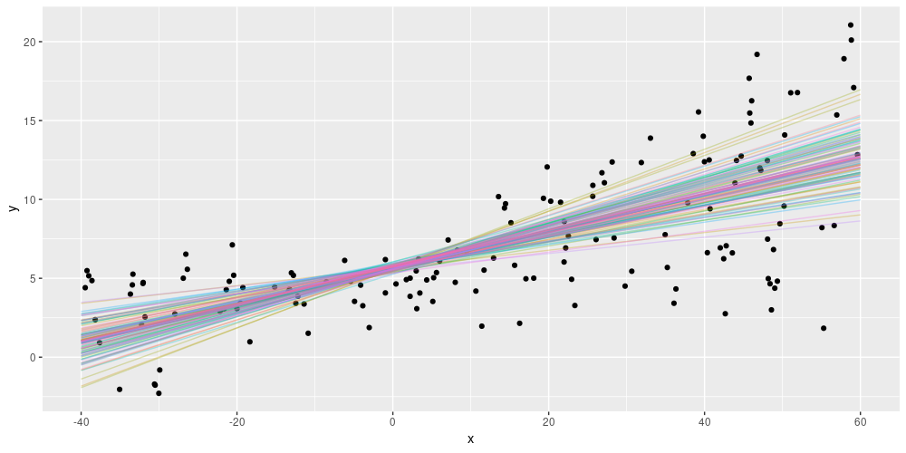
</figure>

---
# Posterior weights are computed using variational inference

<figure>
    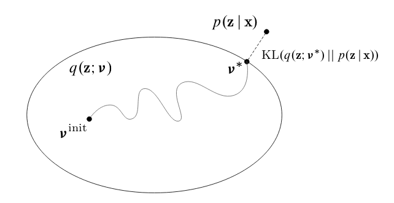
    <figcaption>Source: <a href="https://media.nips.cc/Conferences/2016/Slides/6199-Slides.pdf">David Blei, Rajesh Ranganath, Shakir Mohamed: Variational Inference:Foundations and Modern Methods. NIPS 2016 Tutorial·December 5, 2016.</a></figcaption>
</figure>

---
# Epistemic and aleatoric uncertainty in one model

```{r, eval=FALSE}
model <- keras_model_sequential() %>%
  layer_dense_variational(
    units = 2,
  ) %>%
  layer_distribution_lambda(function(x)
    tfd_normal(loc = x[, 1, drop = FALSE],
               scale = 1e-3 + tf$math$softplus(0.01 * x[, 2, drop = FALSE])
               )
    )

yhats <- purrr::map(1:100, function(x) model(tf$constant(x_test)))
means <-
  purrr::map(yhats, purrr::compose(as.matrix, tfd_mean)) %>% abind::abind()
sds <-
  purrr::map(yhats, purrr::compose(as.matrix, tfd_stddev)) %>% abind::abind()
```


---
# Main challenge now is how to display ...

Each line is one draw from the posterior weights; each line has its own standard deviation.

<figure>
    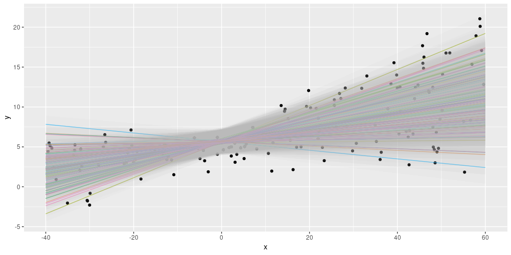
</figure>

More background: https://blogs.rstudio.com/tensorflow/posts/2019-06-05-uncertainty-estimates-tfprobability/

---
class: inverse, middle, center


# Other ways of modeling uncertainty with TFP


---
# Variational autoencoders: Informative latent codes

<figure>
    
    <figcaption>Source: https://lilianweng.github.io/lil-log/2018/08/12/from-autoencoder-to-beta-vae.html</figcaption>
</figure>


---
# Variational autoencoders with tfprobability

```{r}, eval=FALSE}
encoder_model <- keras_model_sequential() %>%
  [...] %>%
  layer_multivariate_normal_tri_l(event_size = encoded_size) %>%
  # pass in the prior of your choice ...
  # can use exact KL divergence or Monte Carlo approximation
  layer_kl_divergence_add_loss([...])

decoder_model <- keras_model_sequential() %>%
  [...] %>%
 layer_independent_bernoulli([...])

vae_model <- keras_model(inputs = encoder_model$inputs,
                         outputs = decoder_model(encoder_model$outputs[1]))
vae_loss <- function (x, rv_x) - (rv_x %>% tfd_log_prob(x))
```

---
# Monte Carlo approximations with tfprobability

- used internally by TFP to perform approximate inference
- `mcmc_`- kernels available to the user:

<figure>
    
</figure>

---
# Example: Modeling tadpole mortality (1)

https://blogs.rstudio.com/tensorflow/posts/2019-05-06-tadpoles-on-tensorflow/

Define a joint probability distribution:

```{r, eval=FALSE}
m2 <- tfd_joint_distribution_sequential(
  list(
    tfd_normal(loc = 0, scale = 1.5),
    tfd_exponential(rate = 1),
    function(sigma, a_bar) 
      tfd_sample_distribution(
        tfd_normal(loc = a_bar, scale = sigma),
        sample_shape = list(n_tadpole_tanks)
      ), 
    function(l)
      tfd_independent(
        tfd_binomial(total_count = n_start, logits = l),
        reinterpreted_batch_ndims = 1
      )))
```

---
# Example: Modeling tadpole mortality (2)

Define optimization target (loss) and kernel (algorithm):

```{r, eval=FALSE}
logprob <- function(a, s, l)
  m2 %>% tfd_log_prob(list(a, s, l, n_surviving))

hmc <- mcmc_hamiltonian_monte_carlo(
  target_log_prob_fn = logprob,
  num_leapfrog_steps = 3,
  step_size = 0.1,
) %>%
  mcmc_simple_step_size_adaptation(
    target_accept_prob = 0.8,
    num_adaptation_steps = n_burnin
  )
```

---
# Example: Modeling tadpole mortality (3)

<br />

Get starting values and sample:

```{r, eval=FALSE}
c(initial_a, initial_s, initial_logits, .) %<-% (m2 %>% tfd_sample(n_chain))

run_mcmc <- function(kernel) {
  kernel %>% mcmc_sample_chain(
    num_results = n_steps,
    num_burnin_steps = n_burnin,
    current_state = list(initial_a, tf$ones_like(initial_s), initial_logits)
  )
res <- hmc %>% run_mcmc()
```


---
# State space models


Use variational inference or (Hamiltonian) Monte Carlo to

- decompose

- filter (as in: Kálmán filter)

- smooth 

- forecast

_dynamic linear models_.

Dynamic regression example: https://blogs.rstudio.com/tensorflow/posts/2019-06-25-dynamic_linear_models_tfprobability/


---
# Dynamic linear models: Filtering example

<figure>
    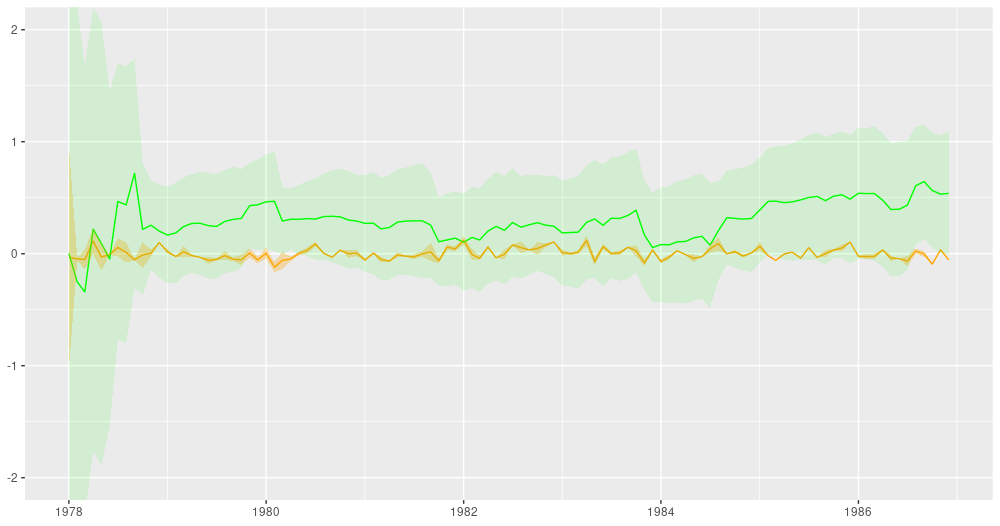
</figure>

---
# Wrapping up

<br />

- _tfprobability_ (TensorFlow Probability) - your toolbox for "everything Bayesian" 

- Lots of ongoing development on the TFP side - stay tuned for cool additions :-)

- Depending on your needs, pick what's most useful to you:

 - Integration with deep learning (Keras layers)
 
 - Monte Carlo Methods
 
 - Dynamic linear models
 
 __Thanks for listening!__


